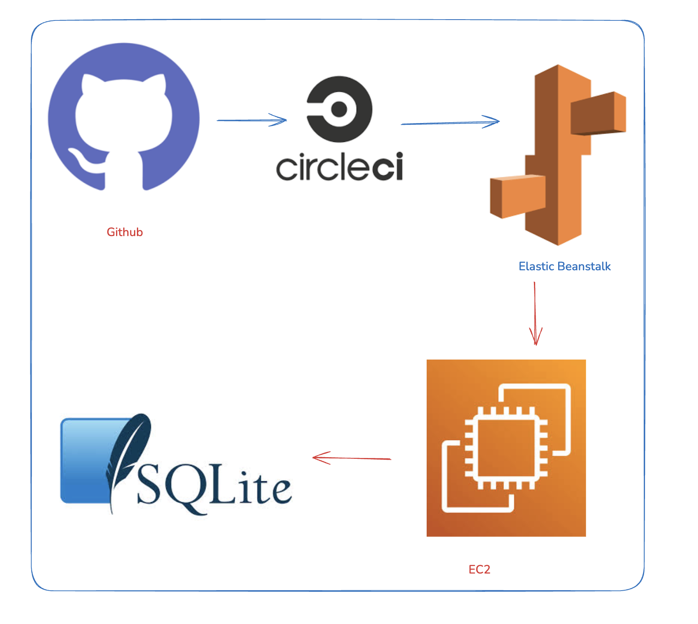
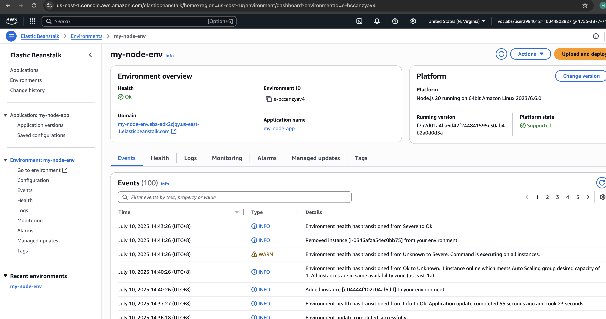
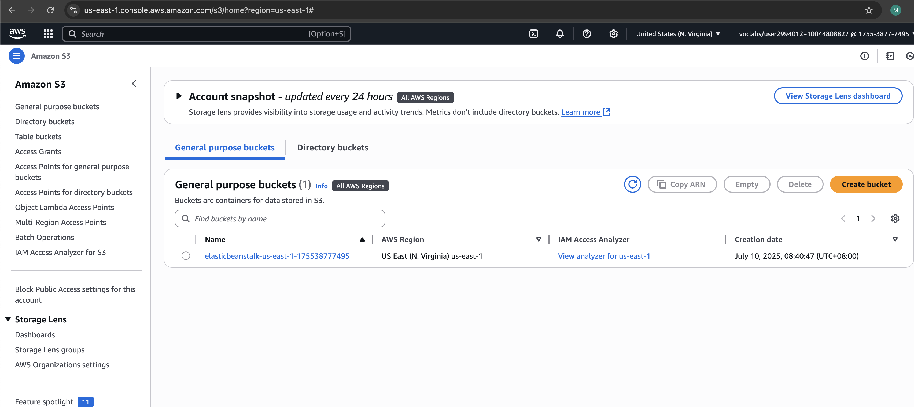
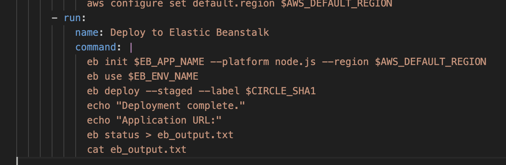
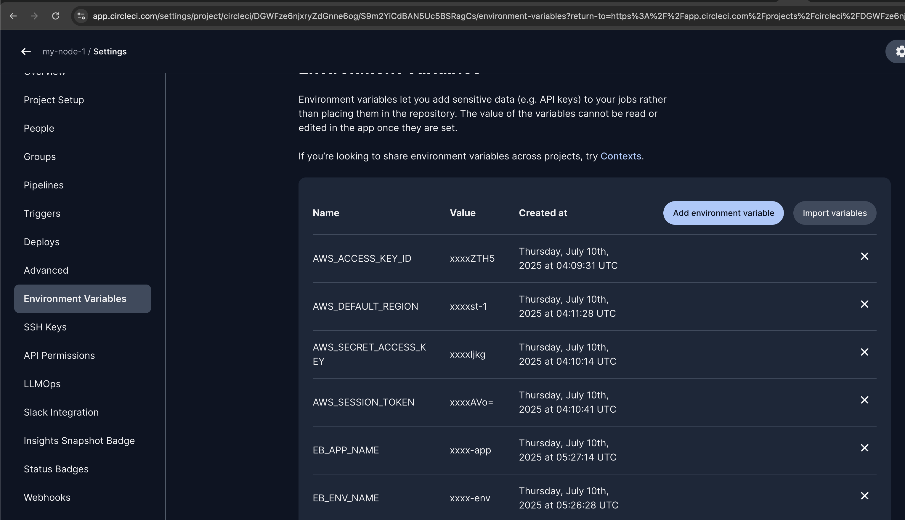
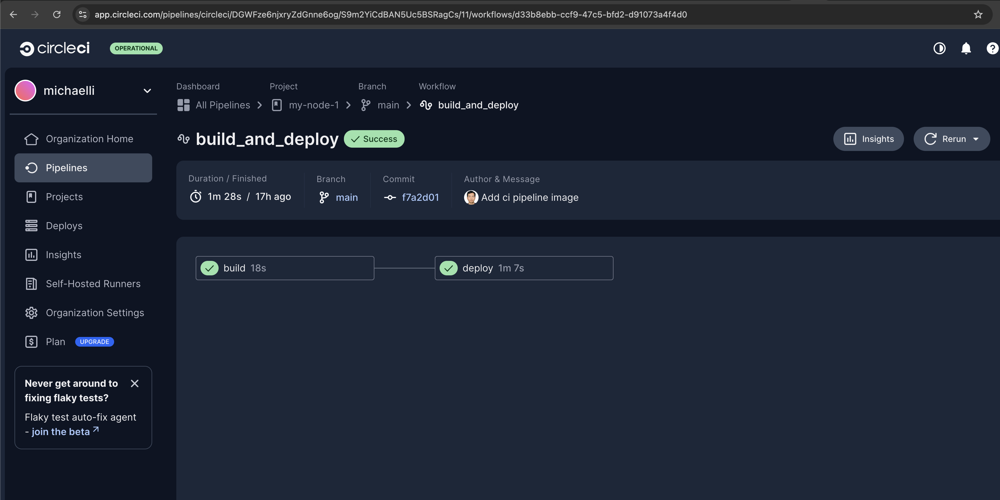

# Infrastructure Description

This application is deployed to AWS using Elastic Beanstalk.

## AWS Resources Used

- **Elastic Beanstalk**: Hosts the Node.js application.
- **EC2**: Underlying instances managed by EB.
- **S3**: Used internally by EB to store application versions.
- **IAM**: For permission and credentials management.

### Deployment Region

- `us-east-1`

### Access

- Application URL is output at the end of the deploy job (e.g., `https://<env>.elasticbeanstalk.com`).

- Screenshot of the DB. I used a customized project which is using local sqllite db

- Screenshot of elastic beanstock

- Screenshot of s3

- Send the secrets from CircleCi to EB. In circle ci, I defined the environment variables and pass to EB

- Circle ci environment variable

- Circle ci pipeline

- Deployed frontend url:

http://my-node-env.eba-adx2cjqy.us-east-1.elasticbeanstalk.com/

- 

